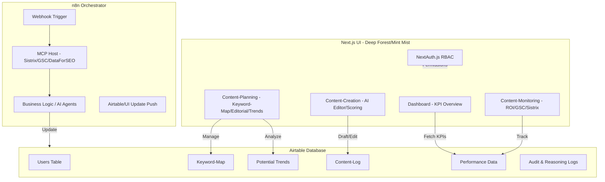

# SEO Content Intelligence OS - Technical Architecture

## 1. System Overview & Diagram

The SEO Content Intelligence OS is a centralized orchestration platform. It uses **Next.js** for the UI, **Airtable** as the Single Source of Truth (SSOT), and **n8n** as the execution engine and MCP host.

## 2. Data Schema (Airtable SSOT)

| Table | Key Fields | Relationships |
| :--- | :--- | :--- |
| **Users** | ID, Name, Email, Role (Admin/Editor), API_Key | Linked to Audit_Logs |
| **Keyword-Map** | Keyword, Target_URL, Search_Volume, Difficulty, Status, Editorial_Deadline | Linked to Performance_Data, Content-Log |
| **Potential_Trends** | Trend_Topic, Source (GSC/Sistrix), Gap_Score, Status (Claimed/Blacklisted) | Linked to Keyword-Map |
| **Content-Log** | ID, Keyword_ID, Version (v1/v2), Content_Body, Diff_Summary, Editor_ID | Linked to Keyword-Map, Users |
| **Performance_Data** | ID, Keyword_ID, Date, GSC_Clicks, GSC_Impressions, Sistrix_VI, Time_to_Rank | Linked to Keyword-Map |
| **Audit_Logs** | ID, Action, Timestamp, User_ID, Reasoning_Chain, Raw_MCP_Response | Linked to Users, Content-Log |

## 3. n8n Orchestration & MCP Integration

### Bi-directional Communication
- **UI to n8n:** Next.js sends a POST request to an n8n Webhook URL with a `workflow_id` and `payload`.
- **n8n to UI:** n8n updates a "Status" field in Airtable and optionally sends a Server-Sent Event (SSE) or triggers a frontend-side polling update.
- **Real-time Logs:** n8n pushes execution logs to the `Audit_Logs` table in Airtable, which the UI fetches via a dedicated log-viewer component.

### MCP Integration
n8n acts as the MCP host, utilizing custom nodes or HTTP Request nodes to interface with:
- **Sistrix MCP:** Live Visibility Index and keyword gap analysis.
- **GSC MCP:** Real-time performance data and URL inspection.
- **DataForSEO MCP:** SERP analysis and competitor content structure.

## 4. Navigation & UI Structure

### View 0: Dashboard (The "Command Center")
- **KPI Overview:** High-level metrics (Total Visibility Index, GSC Clicks Trend, Content Efficiency).
- **Alerts:** Notifications from the "Closed Loop" diagnostic system (e.g., "Ranking Drop Detected").

### View 1: Content-Planning (The "Strategist")
- **Keyword-Map:** Centralized view of all target keywords and their current status.
- **Editorial Plan:** Calendar/List view of upcoming content tasks and deadlines.
- **Trends:** Data pipeline for ingesting Google Trends/Sistrix gaps into a "Claim/Blacklist" workflow.

### View 2: Content-Creation (The "Forge")
- **AI Editor:** Side-by-side diffing using `jsdiff` or similar, comparing `v1` (Current) vs `v2` (AI Proposed).
- **Scoring Engine:** Slider-based UI (0-100) for "SEO Readiness," "Brand Voice," and "Technical Health."

### View 3: Content-Monitoring (The "Oracle")
- **ROI/Reporting:** Aggregated view of GSC/Sistrix data.
- **Efficiency:** Calculation of "Time-to-Rank" (Date of Content Update vs Date of Top 10 Ranking).

## 5. The "Closed Loop" Diagnostic System
1. **Detection:** n8n monitors GSC via MCP. If Clicks/Impressions drop >20% WoW.
2. **Diagnosis:** n8n triggers MCP-based competitor analysis (Sistrix/DataForSEO) to identify what changed in the SERP.
3. **Proposal:** AI generates a "Corrective Draft" and pushes it to `Content-Log` as `v2-proposed`.
4. **Notification:** UI alerts the Editor to review the "Reasoning Log" and approve the draft.

## 6. Security & RBAC (NextAuth.js)
- **Admin:** Access to API configuration, n8n workflow management, and full Audit Logs.
- **Editor:** Access to Planning, Creation, and Monitoring. Restricted from system settings.
- **Implementation:** JWT-based sessions with role-based middleware in Next.js.

## 7. Audit & Reasoning
Every AI-driven change includes a `Reasoning_Chain` in the `Audit_Logs`. This captures:
- **Input Data:** The specific GSC/Sistrix metrics that triggered the change.
- **Logic:** The prompt/model used.
- **Outcome:** The intended SEO impact.
