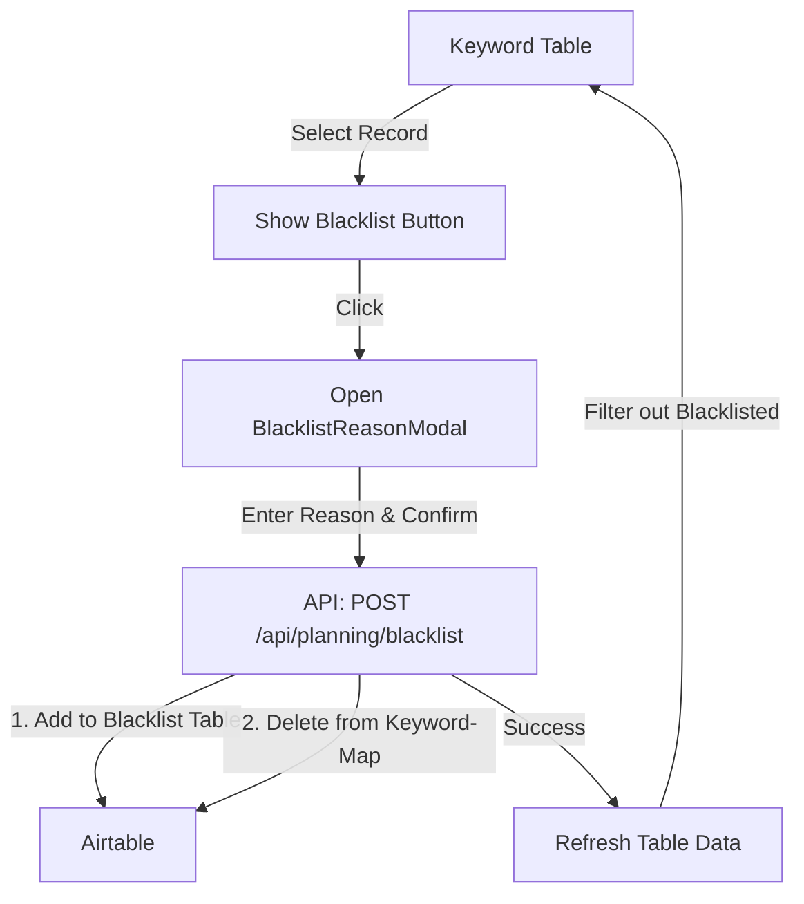

# Blacklist Feature Implementation Plan

## Overview
Implement a feature to move keywords from the Keyword-Map to the Blacklist with a reason.

## 1. API Changes

### `src/app/api/planning/blacklist/route.ts`
- Update `POST` to handle an optional `keywordId`.
- If `keywordId` is provided:
    1. Add the keyword to the Blacklist table (using existing `addToBlacklist`).
    2. Delete the keyword from the Keyword-Map table (using `deleteKeyword`).
    3. Return success.
- This ensures an atomic-like operation from the frontend's perspective.

## 2. Component Changes

### `src/app/planning/blacklist-reason-modal.tsx` (New)
- A dialog component that takes `keyword` and `open` props.
- Contains a textarea for the "Reason".
- "Confirm" button triggers the API call.
- "Cancel" button closes the modal.

### `src/app/planning/keyword-table.tsx`
- Add `ShieldAlert` icon from `lucide-react`.
- In `FilterBar`:
    - Add a "Blacklist" button next to the "Delete" button when rows are selected.
    - This button opens the `BlacklistReasonModal` for bulk blacklisting (or we start with single and expand).
    - *Correction*: The requirement says "when a record is selected". I will add it to the `FilterBar` for bulk actions and potentially to the row actions if they exist (currently rows open an edit modal on click).
- Update `KeywordTable` state to manage the `BlacklistReasonModal` visibility and the selected keyword(s) for blacklisting.

## 3. Data Filtering

### `src/lib/airtable.ts`
- Update `getKeywordMap` to filter out keywords that are present in the Blacklist table.
- Since Airtable doesn't support easy cross-table joins in a single `select()`, we have two options:
    1. Fetch both and filter in memory (simplest for current data scale).
    2. Use a formula if there's a linked field (not guaranteed).
- **Decision**: Fetch blacklist keywords and filter the `KeywordMap` results in `getKeywordMap` or in the API route.

## 4. Implementation Steps

1.  **Backend**:
    *   Modify `src/app/api/planning/blacklist/route.ts` to support the "move" logic.
    *   Update `src/lib/airtable.ts` to exclude blacklisted keywords from `getKeywordMap`.
2.  **Frontend**:
    *   Create `src/app/planning/blacklist-reason-modal.tsx`.
    *   Integrate the modal and "Blacklist" button into `src/app/planning/keyword-table.tsx`.
    *   Ensure the table refreshes after a keyword is blacklisted.

## Mermaid Diagram

