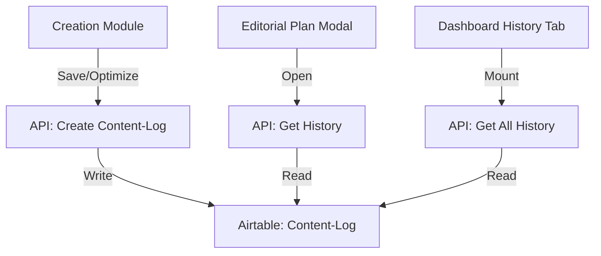

# Implementation Plan: Content History System

This plan outlines the implementation of a Content History system to track text creation and optimization actions per URL.

## 1. System Architecture

The system will use the existing `Content-Log` table in Airtable to store history entries. Each entry will link to a keyword/URL and record the type of action (Creation vs. Optimization) and the timestamp.

### 1.1 Data Model (Airtable: Content-Log)
Ensure the following fields are present in the `Content-Log` table:
- `Keyword_ID`: Link to `Keyword-Map` (Existing)
- `Action_Type`: Single Select ('Erstellung', 'Optimierung')
- `Created_At`: Date/Time (Existing)
- `Content_Body`: Long Text (Existing, for storing the version)
- `Editor`: Link to `Users` (Optional, for tracking who did it)

## 2. Technical Requirements

### 2.1 Backend (API & Airtable)
- **Logging Logic**: Implement a utility to create a `Content-Log` entry whenever a text is saved or optimized in the Creation module.
- **Data Fetching**: Update `src/lib/airtable.ts` to allow fetching history for a specific `Keyword_ID`.

### 2.2 UI Components
- **Dashboard Tab**: Add a new "Content-Historie" tab to the main dashboard ([`src/app/page.tsx`](src/app/page.tsx)).
- **Detail View Integration**: Add a "Content-Historie" section to the `EditEditorialModal` in [`src/app/planning/editorial-planning.tsx`](src/app/planning/editorial-planning.tsx).
- **History Display**: Show the latest entry prominently (e.g., "Zuletzt optimiert am XX.XX.XXXX").

## 3. Implementation Steps

### Phase 1: Data & API
- [ ] Verify/Update `ContentLog` interface in [`src/lib/airtable-types.ts`](src/lib/airtable-types.ts).
- [ ] Add `getContentHistoryByKeyword(keywordId: string)` to [`src/lib/airtable.ts`](src/lib/airtable.ts).
- [ ] Create API route `GET /api/planning/history?keywordId=...` to fetch history.

### Phase 2: Detail View Integration
- [ ] Add `history` state to `EditEditorialModal`.
- [ ] Fetch history when the modal opens for a specific keyword.
- [ ] Render the "Content-Historie" section with the latest action and a list of previous changes.

### Phase 3: Dashboard Tab
- [ ] Add "Content-Historie" to the `Tabs` component in [`src/app/page.tsx`](src/app/page.tsx).
- [ ] Create a `ContentHistoryTable` component to show a global feed of recent changes.

### Phase 4: Logging Integration
- [ ] Update the save logic in the Creation module ([`src/app/creation/ai-editor-workspace.tsx`](src/app/creation/ai-editor-workspace.tsx)) to trigger a `Content-Log` entry.

## 4. Mermaid Diagram: History Flow

