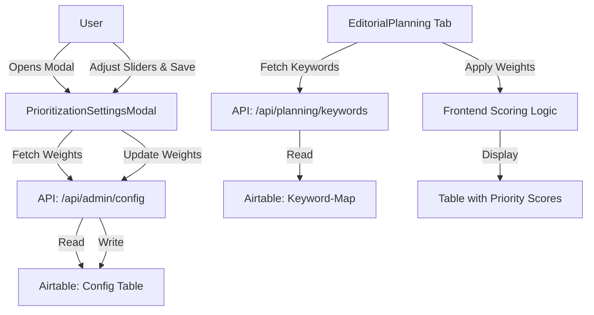

# Implementation Plan: Editorial Plan Prioritization System

This plan outlines the implementation of an automated topic prioritization system for the Editorial Plan (Redaktions-Planung) tab.

## 1. System Architecture

The system will use a weighted scoring algorithm to calculate a `Priority Score` for each keyword in the Editorial Plan. The weights will be stored in the Airtable `Config` table and managed via a new UI component.

### 1.1 Metrics & Scoring Formula
The priority score ($S$) is calculated as:
$S = (SV \cdot w_1) + (D \cdot w_2) + (AC \cdot w_3) + (AV \cdot w_4) + (P \cdot w_5)$

Where:
- $SV$: Search Volume (normalized 0-100)
- $D$: Difficulty (normalized 0-100, usually inverted as lower difficulty is better)
- $AC$: Article Count (normalized 0-100)
- $AV$: Average Article Value (normalized 0-100)
- $P$: Policy/Politik (normalized 0-100)
- $w_n$: Global weighting coefficients (0.0 to 1.0)

## 2. Technical Requirements

### 2.1 Backend (Airtable & API)
- **Config Table**: Ensure the following keys exist or can be created in the `Config` table:
  - `weight_search_volume`
  - `weight_difficulty`
  - `weight_article_count`
  - `weight_avg_value`
  - `weight_policy`
- **Data Types**: Update `KeywordMap` interface in [`src/lib/airtable-types.ts`](src/lib/airtable-types.ts) to include `Policy` (if missing) and `Priority_Score`.

### 2.2 UI Components
- **Prioritization Settings Modal**: A new component [`src/app/planning/prioritization-settings-modal.tsx`](src/app/planning/prioritization-settings-modal.tsx) using Radix UI Dialog and Sliders.
- **Toolbar Integration**: Add the "Priorisierung" button to the toolbar in [`src/app/planning/editorial-planning.tsx`](src/app/planning/editorial-planning.tsx).
- **Dynamic Calculation**: Implement a hook or utility to calculate scores on the fly in the frontend when weights change, or update them via a background process.

## 3. Implementation Steps

### Phase 1: Data & Configuration
- [ ] Update `KeywordMap` interface in [`src/lib/airtable-types.ts`](src/lib/airtable-types.ts).
- [ ] Add default weighting constants to `src/lib/constants.ts` (or similar).
- [ ] Verify `Config` API handles the new weighting keys.

### Phase 2: UI Development
- [ ] Create `PrioritizationSettingsModal` component.
- [ ] Add "Priorisierung" button to `EditorialPlanning` toolbar.
- [ ] Implement weight fetching and saving logic in the modal.

### Phase 3: Scoring Logic
- [ ] Implement `calculatePriorityScore` utility function.
- [ ] Update `EditorialPlanning` to display the calculated score.
- [ ] Add sorting capability by `Priority Score`.

### Phase 4: Refinement
- [ ] Ensure German localization for all new UI elements.
- [ ] Add defensive checks for missing metric values.

## 4. Mermaid Diagram: Data Flow

